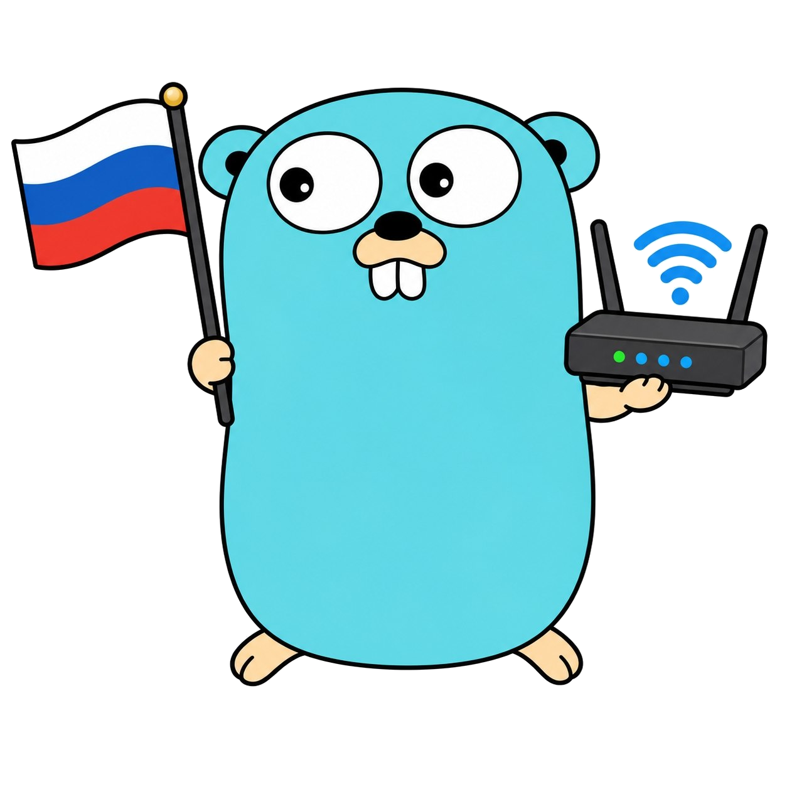

# ksd — Killswitch daemon for OpenWrt

  
  
  

  

  
  
  

A Go daemon that implements a fail-close killswitch for OpenWrt on top of nftables.
Intended for use with Passwall2: all unmarked traffic is blocked
unless it is headed to an allowed VPS address.

## Features

- Atomic application of nftables rules (nft transaction)
- Automatic rollback to baseline on errors
- Blocking of DNS / DoT / DoQ / DoH leaks
- Optional QUIC (UDP/443) blocking
- LAN client protection via the forward hook
- ARP spoofing protection
- MSS clamp and optional TTL set
- Periodic verification of the rules in the kernel
- Zero external dependencies (CGO_ENABLED=0, static build)

## Building

    go build -o ksd ./...

Cross-compiling for OpenWrt (ARM64 example):

    GOOS=linux GOARCH=arm64 CGO_ENABLED=0 go build -o ksd-arm64 ./...

## Installation

> ⚠️ **Keep UART or a second SSH session open.** If ksd blocks access, you will be able to recover from there.

1. Download the binary for your router architecture (`uname -m`):

       wget https://github.com/Artronah1/KSD/releases/latest/download/ksd-arm64
       sha256sum ksd-arm64

   The hash must match the `sha256` value on the release page.

2. Copy the files to the router:

       scp ksd-arm64 root@192.168.1.1:/tmp/ksd
       scp openwrt/killswitch.config root@192.168.1.1:/etc/config/killswitch
       scp openwrt/ksd-boot root@192.168.1.1:/etc/init.d/ksd-boot

3. Install on the router:

       ssh root@192.168.1.1

       cp /tmp/ksd /usr/sbin/ksd
       chmod +x /usr/sbin/ksd /etc/init.d/ksd-boot
       /etc/init.d/ksd-boot enable

4. Check the config `/etc/config/killswitch`:

       nano /etc/config/killswitch

   Make sure these are correct: `source_set`, `wan_interface` / `wan_device`,
   `allowed_iface`, `arp_protection` and `arp_gateway_mac`.

5. First run:

       /usr/sbin/ksd install -config /etc/config/killswitch

6. Enable autostart and start:

       /etc/init.d/ksd enable
       /etc/init.d/ksd start

7. Verify:

       /usr/sbin/ksd status -config /etc/config/killswitch
       /usr/sbin/ksd self-test -config /etc/config/killswitch

   Both should show `[OK]` and `Result: PASS`.

## Automatic installation

Universal installer: detects architecture, WAN, LAN bridges, gateway+MAC,
VPS source set; generates `/etc/config/killswitch`; downloads the matching
binary; installs the service.

**On the router:**

    wget -O /tmp/install.sh https://raw.githubusercontent.com/Artronah1/KSD/main/scripts/install.sh
    sh /tmp/install.sh

**Options:**

    sh /tmp/install.sh -v v1.1.4           # pin a version
    sh /tmp/install.sh -f /tmp/ksd-arm64   # local binary

**If `/etc/config/killswitch` already exists** — the installer keeps it
and does not touch it. Review `source_set`, `wan_device`, `arp_gateway`
**manually**.

**After install** — restart:

    /etc/init.d/ksd restart

## Configurator

Interactive TUI configurator for UCI:

    scripts/ksdc

Lets you manage all options in `/etc/config/killswitch` without running `uci set` by hand.
After making changes, use the "Apply and restart" menu item.

## Documentation

- [CONFIG.md](CONFIG.md) — description of all UCI options
- [BUILD.md](BUILD.md) — build details
- [docs/OPERATOR.en.md](docs/OPERATOR.en.md) — operator guide
- [docs/DESCRIPTION.en.md](docs/DESCRIPTION.en.md) — project description

## License

Mulan Public License, Version 2 (Mulan PubL v2) — see [LICENSE](LICENSE) for details.

**Copyleft** with a network clause: derivative works, including providing
services over a network, must be distributed under the same license with
source code available.

## Status

- v3.5 (shell) — reference implementation, frozen 2026-08-30
- v4.0 (Go) — active development
